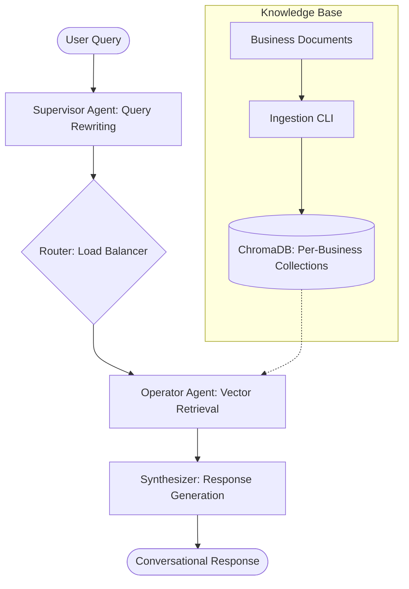

# 🤖 QuickChat: Agentic RAG for Local Businesses

[](https://www.python.org/)
[](https://langchain-ai.github.io/langgraph/)
[](https://streamlit.io/)
[](https://www.trychroma.com/)

**QuickChat** is a state-of-the-art, agentic RAG (Retrieval-Augmented Generation) system designed to provide intelligent customer support for local small businesses. It leverages multi-agent orchestration to transform raw business documentation into professional, context-aware conversations.

---

## 🌟 What the Project Does?

QuickChat acts as a virtual concierge for multiple businesses simultaneously. By simply pointing the system to a folder of documents (PDFs, Markdown, Text), it:
1.  **Ingests & Indexes**: Automatically processes documents into a high-dimensional vector space.
2.  **Understands Context**: Uses a **Supervisor Agent** to rewrite user queries for better retrieval.
3.  **Retrieves Precisely**: Employs an **Operator Agent** to find the exact information needed from the business-specific knowledge base.
4.  **Generates Professionally**: Synthesizes responses that sound like experienced customer support, handling date-aware queries and specific business nuances.

## 🚀 Why This Project is Useful?

-   **Scalable Support**: One system can manage hundreds of businesses, each with its own isolated knowledge base.
-   **Local First**: Optimized for privacy and cost, supporting **Ollama** for 100% on-device execution.
-   **High Performance**: Integrates **Groq** for lightning-fast responses using cloud-scale LLMs when needed.
-   **Customizable**: Easily adaptable to any industry—from a local café's menu to a technical FAQ for a SaaS startup.

---

## 🏗 Architecture Diagram

QuickChat uses a **LangGraph State Machine** to coordinate the flow of information between specialized agents. For more detailed information on the system design, components, and data flow, please refer to the [Full Architecture Document](architecture.md).



### Core Components
-   **Supervisor Node**: Rewrites queries to optimize them for vector search (Query Expansion).
-   **Operator Node**: Performs similarity search on ChromaDB collections.
-   **Synthesizer Node**: Uses the retrieved context + LLM to generate the final response.
-   **Ingestion Pipeline**: A CLI tool that processes raw files into embeddings using `sentence-transformers`.

---

## 🛠 Technology Stack

-   **LLM Orchestration**: [LangGraph](https://langchain-ai.github.io/langgraph/) (Advanced state-machine based agents)
-   **Framework**: [LangChain](https://www.langchain.com/)
-   **LLM Providers**: [Ollama](https://ollama.com/) (Local), [Groq](https://groq.com/) (Cloud)
-   **Vector Database**: [ChromaDB](https://www.trychroma.com/)
-   **Embeddings**: `sentence-transformers/all-MiniLM-L6-v2`
-   **UI Framework**: [Streamlit](https://streamlit.io/) with custom CSS/Glassmorphism.
-   **Language**: Python 3.10+

---

## 🏁 Getting Started

Follow these steps to set up QuickChat on your local machine.

### 1. Prerequisites
-   **Python 3.10+** installed.
-   **Ollama** (optional, for local LLM usage). [Download here](https://ollama.com/).

### 2. Installation

#### For Windows (PowerShell)
```powershell
# Clone the repository
git clone https://github.com/your-username/quick_chat.git
cd quick_chat

# Create and activate virtual environment
python -m venv .venv
.\.venv\Scripts\activate

# Install dependencies
pip install -r requirements.txt
```

#### For Linux / macOS
```bash
# Clone the repository
git clone https://github.com/your-username/quick_chat.git
cd quick_chat

# Create and activate virtual environment
python3 -m venv .venv
source .venv/bin/activate

# Install dependencies
pip install -r requirements.txt
```

### 3. Ingest Data
Place your business documents in `data/` (organized by folders) and run:

```bash
# Windows & Linux
python scripts/ingest_documents.py --source-dir ./data --chroma-persist ./data/chroma
```

### 4. Run the Application
Start the Streamlit UI:

```bash
streamlit run app/streamlit_app.py
```

### 5. Run Tests
Verify your installation and RAG pipeline:

```bash
python tests/smoke_test.py
```

### 📊 6. Run Evaluations
Measure the quality of your RAG responses using an LLM-as-a-judge:

```bash
python tests/eval_runner.py --name "baseline_run"
```
This script runs a set of test queries, compares them against ground truth, and scores them on **Accuracy**, **Faithfulness**, and **Tone**. Detailed results are saved in `tests/eval_runs/` and a summary history is kept in `tests/eval_history.json`.

---


## ⚙️ Configuration

Configure the system via environment variables or a `.env` file:

| Variable | Description | Default |
| :--- | :--- | :--- |
| `LLM_PROVIDER` | Choose `ollama` or `groq` | `ollama` |
| `GROQ_API_KEY` | Required if using Groq | - |
| `OLLAMA_MODEL` | Local model name | `qwen2.5-coder:7b` |
| `CHROMA_PERSIST_PATH` | Path to vector database | `./data/chroma` |

---

## 👤 Author
**Ram Pradeep Nalluri** - *Data Engineer & AI Engineer | Agent Enthusiast*

[](https://www.linkedin.com/in/ramnalluri/)

Showcasing skills in Multi-Agent Systems, RAG, and Scalable AI Orchestration.

