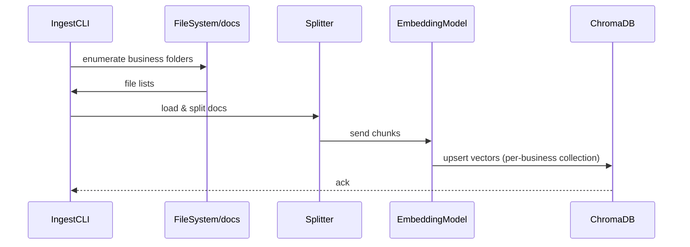
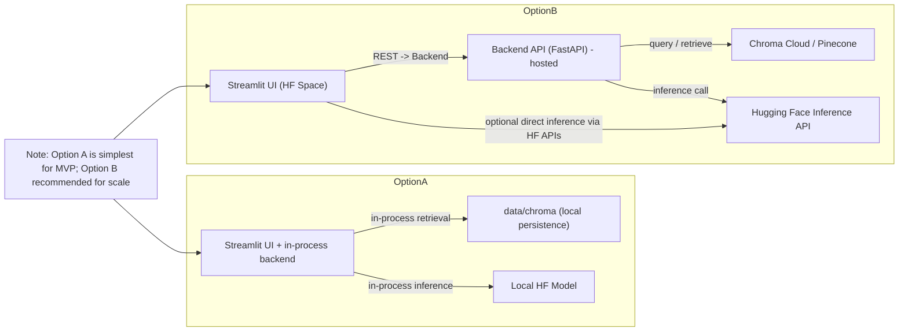
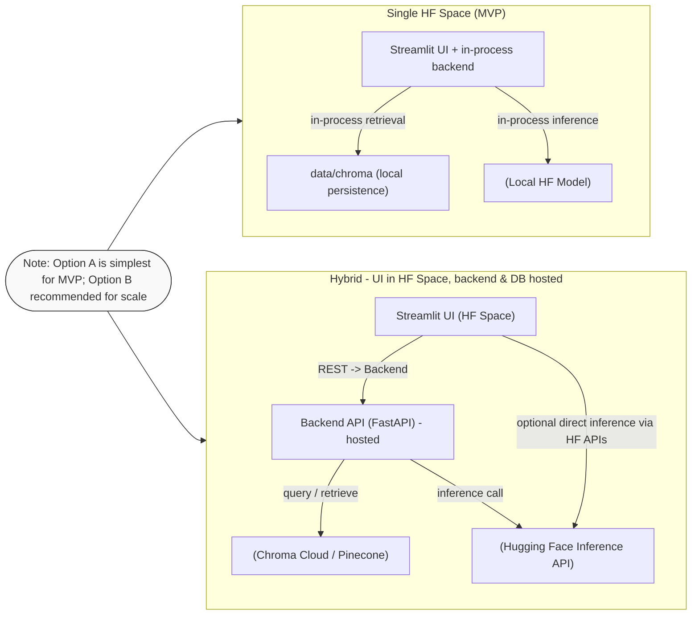

# System Architecture Document

## Introduction

This document is a build-ready system architecture for the Customer Support AI Assistant MVP. It is written so an engineer or coding assistant can implement the end-to-end solution and deployment scripts.

## System Overview

The system provides a Streamlit UI (customer-facing) and a Python backend built with LangChain. It uses a vector database to store business documents and supports RAG for responses. Components include ingestion, routing, session/state management, agents, and model integrations.

## Technology Stack (MVP)

- Frontend: Streamlit
- Backend: Python + LangGraph
- Orchestration: LangGraph State Machine
- LLM Integration: LangChain (langchain-ollama, langchain-groq)
- Embeddings: sentence-transformers / Hugging Face embeddings via LangChain
- Vector DB (MVP): ChromaDB (local persistence)

Rationale: ChromaDB is chosen for MVP because it's easy to embed, can run locally or within the same host, and integrates with LangChain. For Hugging Face Spaces deployment, Chroma can be run in-process or you can use Chroma Cloud / Pinecone for persistent, multi-user access.

## Repository Layout (recommended)

- app/                     # streamlit app + backend integrated for MVP
    - streamlit_app.py       # entrypoint for UI
    - graph.py               # LangGraph workflow definition
    - api.py                 # Graph-aware backend endpoints
    - agents/                # Agent core logic (refactored for LangChain)
      - __init__.py
      - supervisor.py         # Query rewriting (Supervisor)
      - operator.py           # RAG retrieval (Operator)
      - response_generator.py # NL generation (Synthesizer)
- scripts/
   - ingest_documents.py    # offline ingestion CLI
   - deploy_hf_space.sh     # helper for HF Spaces deployment
- models/
- data/
   - chroma/                # optional local persistence path for Chroma
- requirements.txt
- README.md

The system uses a **LangGraph** State Machine:


### Component Responsibilities

**Supervisor Agent** (`supervisor.py`)
- Validates user queries and task context
- Coordinates task assignment
- Ensures proper task flow through the system

**Router Agent** (`router.py`)
- Implements operator pool management
- Assigns tasks to available operators
- Tracks operator availability

**Operator Agent** (`operator.py`) — MUST BE GENERIC
- Retrieves relevant documents using vector similarity search
- Returns raw documents (RAG output)
- **IMPORTANT**: Contains NO business-specific logic
- Works identically for any business without modification
- Pure retrieval function: `query → similarity search → raw documents`

**ResponseGenerator** (`response_generator.py`) — Post-Processing Layer
- Converts raw documents into natural, conversational responses
- Handles date-aware queries (e.g., "is there a class today?")
- Applies conversational tone (sounds like customer support)
- Extracts context from retrieved documents where relevant
- Business-agnostic: uses generic formatting rules that work for any business

### Why This Separation?

- **Operator Generic**: Ensures any business can be added without code changes
- **ResponseGenerator Separate**: Handles conversational logic, date awareness, and formatting without polluting the pure RAG agent component
- **Clear Separation of Concerns**: Retrieval (Operator) vs. Presentation (ResponseGenerator)

## Added Component: Offline Document Ingestion

Purpose: Bulk-harvest business documents from a folder structure and upsert embeddings into the vector DB under per-business collections/namespaces.

Folder convention (input):

- docs/
   - business_abc/
      - brochure.pdf
      - faq.md
   - business_xyz/
      - menu.pdf
      - policies.md

Script: `scripts/ingest_documents.py`

Behavior (build-ready):

- Walk the `--source-dir` and treat each top-level folder as one business id.
- For each business folder:
   - Load documents (PDF, txt, md). Use `unstructured` or `pdfplumber` as needed.
   - Normalize text and run LangChain `TextSplitter` to chunk documents.
   - Calculate embeddings using `HuggingFaceEmbeddings` or `SentenceTransformers` via LangChain.
   - Upsert vectors into Chroma under a collection named `business__{business_id}` or using `metadata:{business_id}`.
   - Track/update a lightweight manifest (JSON) with last-harvest timestamps so re-runs only update changed files.

CLI example:

```
python scripts/ingest_documents.py \
   --source-dir ./docs \
   --chroma-persist ./data/chroma \
   --model sentence-transformers/all-MiniLM-L6-v2 \
   --batch-size 256
```

Script outline (pseudo):

```py
# scripts/ingest_documents.py (outline)
from langchain.text_splitter import RecursiveCharacterTextSplitter
from langchain.embeddings import HuggingFaceEmbeddings
import chromadb

def ingest_folder(source_dir, chroma_persist, model_name, ...):
      client = chromadb.PersistentClient(path=chroma_persist)
      embeddings = HuggingFaceEmbeddings(model_name=model_name)
      for business_dir in list_top_level_dirs(source_dir):
            docs = load_docs_from_dir(business_dir)
            chunks = split_docs(docs)
            vectors = embeddings.embed_documents([c.page_content for c in chunks])
            collection_name = f"business__{business_id}"
            col = client.get_or_create_collection(collection_name)
            col.add(documents=[c.page_content...], embeddings=vectors, metadatas=[...])

if __name__ == '__main__':
      # parse args and call ingest_folder

```

Notes:
- Use a manifest (JSON) that stores file checksums and last indexed time to avoid re-ingesting unchanged files.
- Keep embedding model configurable; choose `all-MiniLM-L6-v2` for cost/perf tradeoff in MVP.

Mermaid: Document ingestion flow



## Integration Points (added)

- Ingestion script writes to the same Chroma collections used at runtime by the API/agents.
- The Supervisor/Router should reference collections by `business_id` when constructing retrieval chains.

## Deployment: Hugging Face Spaces (detailed)

Two deployment options for MVP on Hugging Face:

1) Single Space (Streamlit-only with integrated backend)
    - Use a Streamlit Space. Keep the backend logic inside the same process (e.g., `api.py` called from `streamlit_app.py`).
    - Benefits: easiest, single repo push to HF Spaces.
    - Limitations: resource limits, not ideal for persistent, multi-user Chroma.

2) Hybrid (Space UI + external vector DB / hosted backend)
    - Deploy UI to HF Spaces (Streamlit) and run a small backend on a cloud VM or container (or use Chroma Cloud / Pinecone) exposing REST endpoints.
    - Benefits: scalable, persistent storage, suitable for multi-user production.

Steps to deploy a Streamlit app to HF Spaces (Option 1):

- Prepare repository with `streamlit_app.py` at root or inside `app/` and `requirements.txt` listing `streamlit`, `langchain`, `chromadb`, `sentence-transformers`, `transformers`, etc.
- Add `app/streamlit_app.py` that imports `api.py` and calls orchestration functions.
- If using Chroma local persistence, set `CHROMA_PERSIST_PATH` to `./data/chroma` (this is persisted in the Space filesystem between builds but subject to Space quotas).


2. To deploy to HF Spaces (quick MVP):
    - Create Space (Streamlit).
    - Push repo to Space using `scripts/deploy_hf_space.sh` or manual git.
    - Configure secrets in Space settings if using hosted Chroma or external APIs.

3. For production-ready persistence (recommended):
    - Move to hosted vector DB (Pinecone/Weaviate/Chroma Cloud).
    - Run backend as a small FastAPI service behind a container; UI remains in Spaces or as separate frontend.

## Deployment Architecture Diagram



## Build-Ready Artifacts to Include in Repo

- `scripts/ingest_documents.py` (CLI) — required
- `app/streamlit_app.py` — UI entry point
- `app/api.py` — orchestrator, Supervisor/Router stubs
- `requirements.txt` — pinned deps
- `scripts/deploy_hf_space.sh` — helper push script
- `README.md` — developer quickstart (ingest → run → deploy)

## Final Notes and Recommendations

- For MVP keep everything in a single repo and prefer Chroma local for cost reasons.
- For deployment to Hugging Face Spaces, consider resource limits — if you need persistence, use a hosted vector DB and store secrets in Space settings.
- Use `sentence-transformers/all-MiniLM-L6-v2` for embeddings in the MVP for good cost/perf.
- Add automated tests for ingestion (checksums), retrieval (k-NN smoke tests), and end-to-end with a small dataset.

If you want, I can also scaffold `scripts/ingest_documents.py`, `requirements.txt`, and a basic `streamlit_app.py` next. 