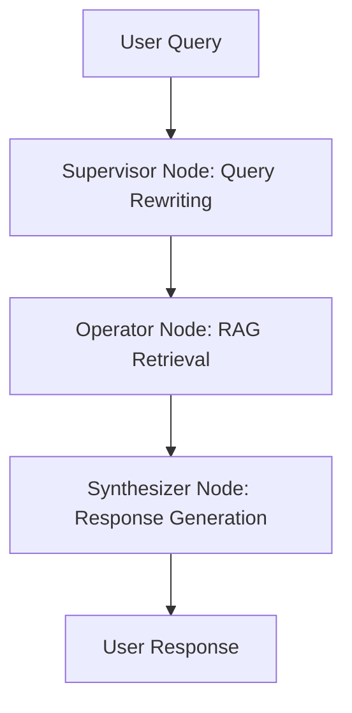

# System Architecture Document

## Introduction

This document provides the high-level system architecture for the QuickChat AI Assistant. It serves as a reference for the multi-agent design, data flow, and technology stack used in the current implementation.

## System Overview

QuickChat is an agentic RAG (Retrieval-Augmented Generation) platform designed for multi-business customer support. It provides a Streamlit-based UI and a Python backend orchestrated by LangGraph. The system isolates knowledge by business using dedicated vector collections and uses a supervisor-operator-synthesizer pattern to ensure high-quality, contextual responses.

## Technology Stack

- **Frontend**: Streamlit (Premium UI with custom CSS/Glassmorphism)
- **Backend**: Python 3.10+
- **Orchestration**: [LangGraph](https://langchain-ai.github.io/langgraph/) (State machine for agent coordination)
- **LLM Integration**: LangChain (`langchain-ollama`, `langchain-groq`)
- **Embeddings**: `langchain-huggingface` (`sentence-transformers/all-MiniLM-L6-v2`)
- **Vector Database**: ChromaDB (Local persistent storage)
- **Document Processing**: `PyPDF2` for PDF extraction

## Repository Layout

- `app/`                     # Core Application Logic
    - `streamlit_app.py`       # Streamlit UI entry point
    - `graph.py`               # LangGraph state machine definition
    - `api.py`                 # Unified backend interface & orchestration
    - `agents/`                # Specialized Agent implementations
      - `supervisor.py`        # Query Rewriting & Context management
      - `router.py`            # Operator pool management & caching
      - `operator.py`          # Generic RAG retrieval logic
      - `response_generator.py` # Natural language synthesis
- `scripts/`                 # Tooling & Pipelines
    - `ingest_documents.py`    # CLI for document ingestion & embedding
    - `deploy_hf_space.sh`     # Helper script for Hugging Face Spaces
- `tests/`                   # Quality Assurance
    - `smoke_test.py`          # Consolidated RAG & DB health check
- `data/`                    # Persistence Layer
    - `chroma/`                # Local ChromaDB storage
- `requirements.txt`         # Dependency manifest
- `README.md`                # User guide and project overview

## Agent Workflow (LangGraph)

QuickChat uses a linear state machine to process user queries. This ensures that every question is refined for optimal retrieval before being answered.

### Component Responsibilities

#### **Supervisor Agent** (`supervisor.py`)
- **Query Rewriting**: Analyzes chat history to resolve pronouns (e.g., "it", "they") into specific entities from previous turns.
- **Contextualization**: Ensures the "standalone query" contains all necessary business context for the vector search.

#### **Router Agent** (`router.py`)
- **Operator Pool**: Manages a pool of `OperatorAgent` instances.
- **Business Context Cache**: Pre-loads and stores business summaries to "warm up" operators, reducing initial response latency.

#### **Operator Agent** (`operator.py`)
- **Generic Retrieval**: Performs similarity search on ChromaDB collections based on the `business_id`.
- **Pure RAG**: Returns raw document chunks. Notably, the Operator is **business-agnostic** and contains no hardcoded business logic.

#### **Response Generator** (`response_generator.py`)
- **Synthesis**: Converts raw chunks into natural language responses.
- **Persona alignment**: Ensures the tone is professional and strictly adheres to the provided context.

## Document Ingestion Pipeline

The ingestion process is decoupled from the runtime to allow for bulk processing of business documentation.

1.  **Enumerate**: Walk the `data/` directory where each folder is treated as a unique `business_id`.
2.  **Extract**: Parse `.pdf`, `.md`, and `.txt` files.
3.  **Split**: Perform "Semantic Splitting" based on Markdown headers to keep related concepts together.
4.  **Embed**: Generate vectors using `HuggingFaceEmbeddings`.
5.  **Upsert**: Store in ChromaDB with a manifest to track file checksums (avoiding redundant processing).

## Deployment Strategy

The system is designed to be deployment-flexible:

-   **Hugging Face Spaces**: Optimized for Streamlit Spaces.
-   **Local Execution**: Supports **Ollama** for 100% private, on-device operation.
-   **Cloud Scale**: Easily switch to **Groq** for high-throughput inference or **Pinecone** for distributed vector storage by updating environment variables.

---
*Last Updated: 2026-02-24*